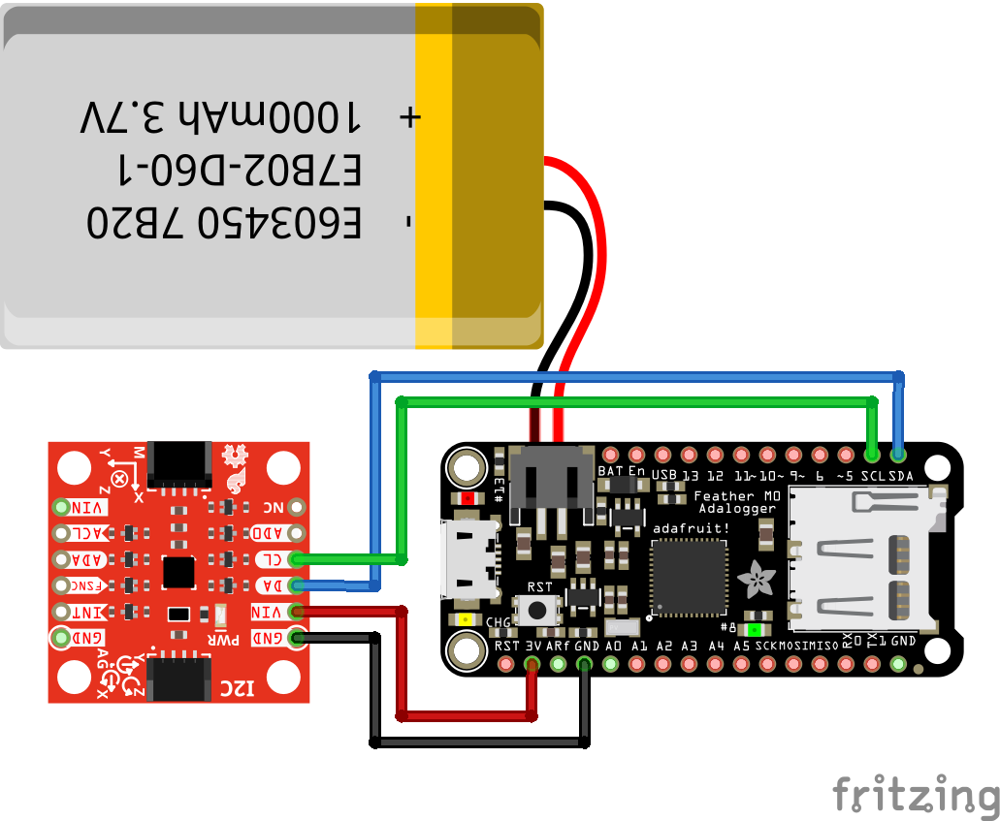

# Simple Motion Sensing And Data Logging Module

## Libraries

- SD Library for Arduino - https://github.com/arduino-libraries/SD
- SparkFun ICM-20948 Arduino Library - https://github.com/sparkfun/SparkFun_ICM-20948_ArduinoLibrary/
   - part of this code is adapted from Example1_Basics

## Hardware

- Adafruit Feather M0 Adalogger
- SparkFun 9DoF IMU Breakout - ICM-20948
- Generic 1000mAh lipo battery connected to feather

